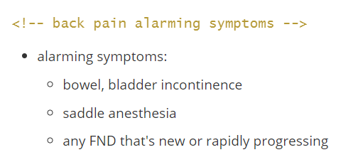
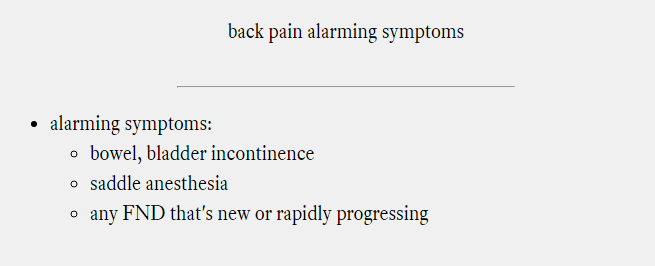
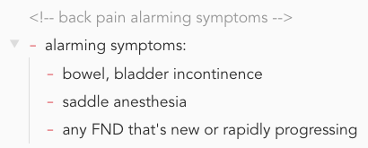
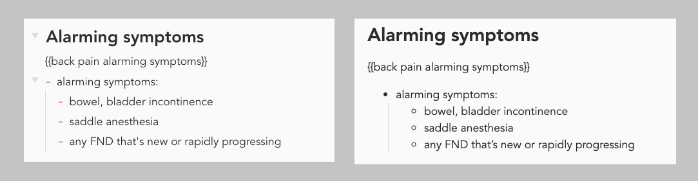
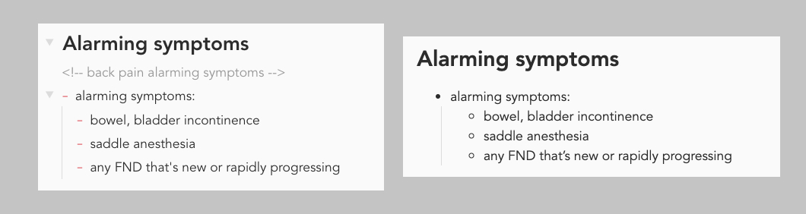

- [Introduction](#Introduction)
- [Disclaimer](#Disclaimer)
- [Todo](#Todo)
- [Getting Started](#Getting-Started)
  - [Installation](#Installation)
  - [Setting up Configuration](#Setting-up-Configuration)
  - [Running the Script](#Running-the-Script)
  - [Setting up Anki](#Setting-up-Anki)
- [Making Cards](#Making-Cards)
  - [Simple Card](#Simple-Card)
  - [Notes Without a Card](#Notes-Without-a-Card)
  - [Multiple Cards in a Note](#Multiple-Cards-in-a-Note)
  - [Exclude Contents in a Note)](#Exclude-Contents-in-a-Note)

# Introduction

<!-- Idea behind Ankify -->

The idea of Ankify is to be able to convert notes into cards. Ideally, you would be able to do the following:

- write notes as you normally would, with minimal amount of distraction/interruption. In fact, this README.md is made up of anki cards that you can only see when editing
- convert note into cards easily
- update existing cards on subsequent conversion

You would do the Anki cards to help memorize the small details, but you always go back to your notes to understand the big concepts. Ankify allows you to do all that.

<!-- quick introduction -->

In your markdown note, you can use a predefined container to define your card. Here’s an example card in markdown format:



The text within `<!--` and `-->` becomes the front of the card, while the bullet points that come after become the back of the card. When you run Ankify, it generates an html file. You can then import the file into Anki. This would become the result card:



# Disclaimer

I originally made Ankify to help me make make Anki cards. I am now sharing the script in hope that others would be able to benefit. However, Ankify is not the most well written script, and certain things would not work under different environment. Make sure you back up your notes before proceed.

# Todo

<!-- These are future todos -->

- [x] rewrite in remark
- [ ] Add cloze deletion
- [ ] User GUI
- [x] Add anki user profile folder
- [x] Make it Mac compatible
- [ ] Option to upload images

# Getting Started

<!-- ignore -->

Ankify works great but requires a bit of a setup in the beginning.

## Installation

<!-- how to install anki -->

Download or clone this repository. Then, run `npm install` to run the dependencies. Next, run `npm link` to make the script run globally.

## Setting up Configuration

<!-- how to configure anki -->

First, you need to tell Ankify where to look for the markdown folder, image folder, and your Anki profile location. Open up `.sample-env` in the root folder of the project. It should like this:

```
ROOT_DIR="D:\Drive\Notes"
ATTACHMENT_FOLDER="D:\Drive\Notes\images"
ANKI_PROFILE="Anki2\User 1\collection.media"
```

Replace “ROOT_DIR” with the directory of your markdown folder. Replace “ATTACHMENT_FOLDER” with your image folder. Replace “ANKI_PROFILE” with your user profile. The default anki profile is "User 1," and the default profile folder for Anki is `Anki2\User 1\collection.media`.

On Mac, the default anki profile folder should be `Anki2/User 1/collection.media`.

After doing all that, rename the file to `.env`.

## Running the Script

 <!-- steps to run the script -->

Open up command prompt and type in `ankify`and enter to run the script:

```
ankify
```

The script does several things:

1. copies all the images to anki media folder
2. makes an html folder inside your markdown folder
3. converts all of the markdown files into one html file

Note, the script does not recursively converts all of the subdirectories. This can be changed with a tweak in index.js if you are interested in that.

## Setting up Anki

<!-- Anki setting -->

Now you have the html file that you can use to import to Anki. Use the following settings in Anki (you can change the deck):


Note `~` is used as the delimiter. I use this because it’s my least used symbol. Just be aware that sometimes you may have this symbol in your text. Ankify deletes the symbol before the conversion process so it would not interfere with the import process.

# Making Cards

## Simple Card

<!-- how to make a simple card -->

In any note, make a card using html comment `<!-- -->` notation. The content inside `<!-- -->` will become the front of the anki card on rendering. The content following the comment will become the back of the card.



The best way to quickly type in the `<!-- -->` is to use a text expander. I have it set up so that `,,` corresponds to `<!--` and that `..` corresponds to `-->`.

Anki uses first field to check for duplicates, which is what's inside `<!-- -->`. If you change the text inside the comment, Anki will import a new card instead. On the other hand, if you change the content after the comment, Anki will update the card instead.

Headers are ignored.

## Using Html Comments

<!-- why I season my html comment and not my card -->

Original Ankify used `{{}}` to define the front of the card. I found this leaves the front of the card visible when rendered to html:



- Left: editor mode; right: rendered mode

In the current version of Anki, html comment `<-- -->` is used as card front. The front of the card disappears on rendering to html. This is especially useful when publishing notes online:



- Left: editor mode; right: rendered mode showing html comments not visible

In fact, this current README.md is a note with Anki cards! You can use this file and the image folder as your test conversion. Open this file up in MD editor to see the comments.

## Notes Without a Card

<!-- ignore -->

Notes without any cards will be ignored.

## Multiple Cards in a Note

<!-- make multiple cards -->

To have multiple cards in a note, simply add more `<-- -->` blocks. The content of each cards ends once a new card begins. For example, the following note will render two cards:


## Exclude Contents in a Note

<!-- how to exclude contents -->

Sometimes you want to exclude parts of the note from being made into a card. I use a ignore card to make this happen. In the following example, only the first and third cards are made:


This is because of first field match that Anki uses. If you have multiple ignore cards, Anki will use the last one instead of importing multiple.
