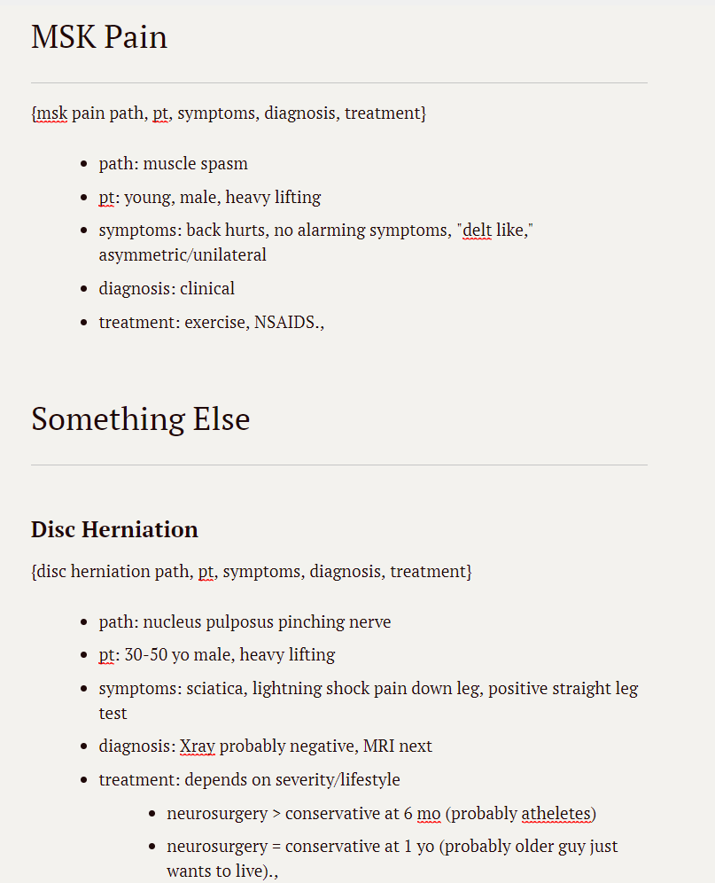
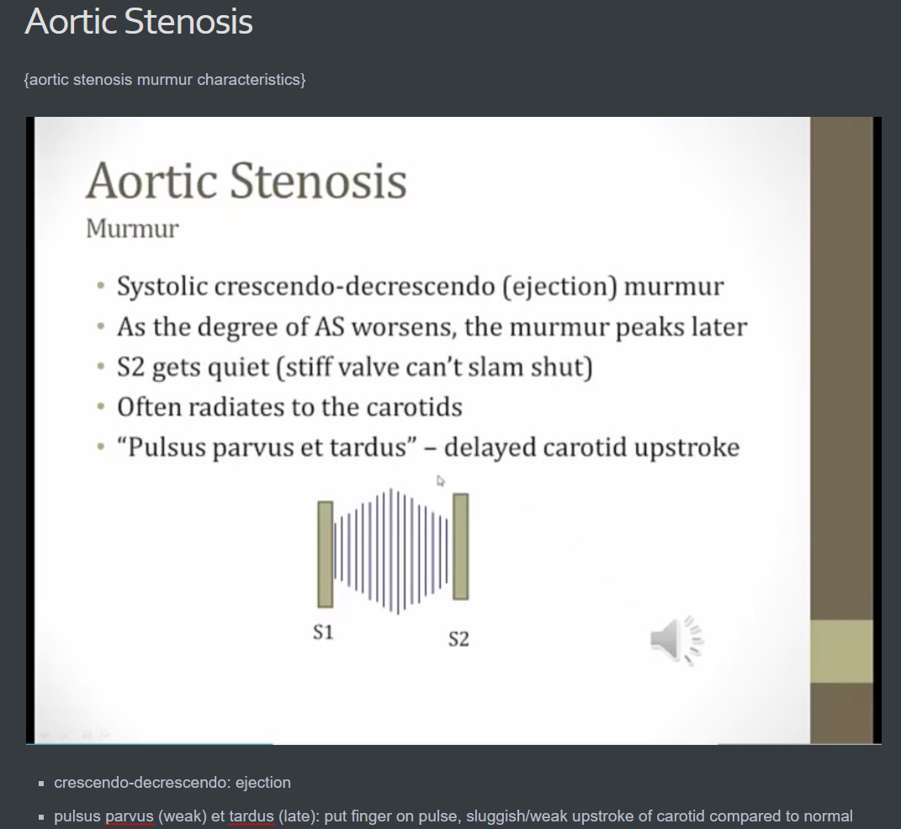
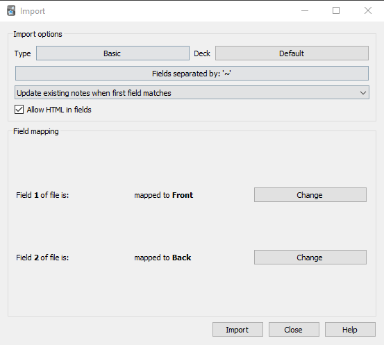

# Ankify
Ankify notes into anki cards.

# Installation

Works only for Mac as of now. Will add Windows version later.

You must have python 3 installed.

You have to install ==the== required add ons for the script:

`pip3 install -r requirements`

# Usage

## Note

Note should look like this:

where {} contains front of card and what follows is back of card. If there's a section you don't want to be included, you can use {ignore} as the front of the card. Make sure the front of the card has a unique question, otherwise anki will overwrite duplicates. You can include anything in the back of the card include images:

Do not use ~ anywhere in the note, as it interferes with the import process. Also, do not use {} in the back of the note. The MDtoANKI script will ignore headings in markdown files. Lastly, the very first thing in your note needs to be a card so that anki can read the html file properly. Sometimes I just put a {ignore} at the very beginning so I don't forget.

## Convert

First, save your notes in .md format from markdown writer you are using (tested with Bear on Mac and Typora), including the images. I've also written a script for Evernote that takes in html files. Advantage of evernote is that you can draw/write on pictures on an Ipad.

Next, place the corresponding script (ENtoAnki for evernote, MDtoANKI for markdown) in the same folder as your exported file.

Click on the script to run.  On Mac it'll open the IDE, you have to go to Run and Run Module to run it. 

The MDtoANKI script converts all .md file to html file into _html folder. It moves the images into ANKI "User 1" media folder. The ENtoANKI script does the same but with html files instead. 

Go to Anki, File, Import, select the html file:

You have to use ~ as the field separator. And it should like the above image.

Result in Anki:

I style my cards so they look ==different.==