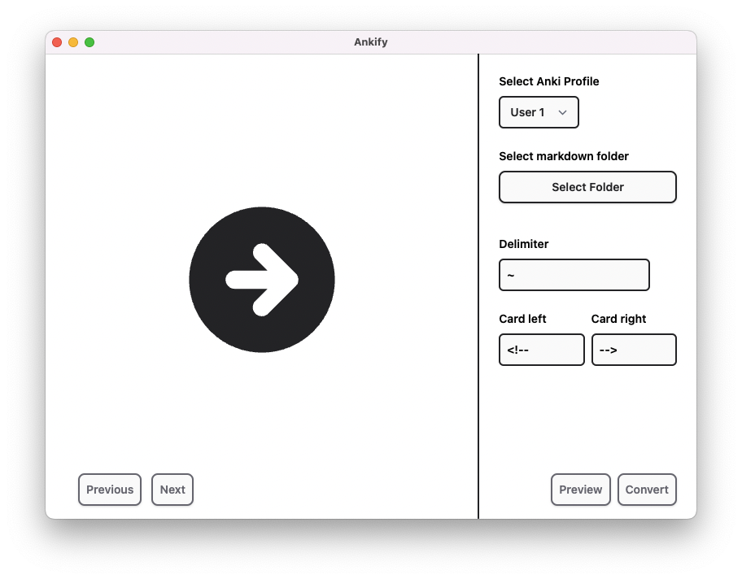

# Ankify

Ankify is a tool that converts markdown notes to Anki cards. This repository hosts the CLI version of Ankify powers the [GUI version](https://ankify.krxiang.com).

Before with markdown:


Ankify:


After importing:


## Table of Contents

- [Installation](#installation)

## Basic Usage

```node index.ts -p "test"```

## Options 

```
Options:
  -l, --listProfiles           list found Anki user profiles (default: false)
  -u, --profile <USERNAME>     use Anki user profile
  -p, --path <MDPATH>          path of markdown files to convert
  -i, --imagePath <IMAGEPATH>  path of images to copy
  -d, --delimiter <DELIMITER>  delimiter to use to separate cards (default: "\t")
  --cardLeft <LEFT>            defines left side of card (default: "<!--")
  --cardRight <RIGHT>          defines right side of card (default: "-->")
  -w, --clozeWrap <CLOZE>      defines cloze wrap option (default: "==")
  -c, --convert                triggers conversion (default: false)
  -h, --help                   display help for command
```