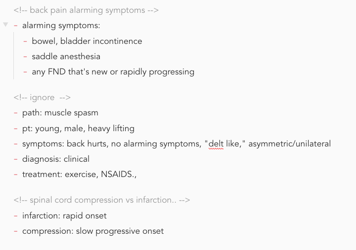

# Making Cards

## Simple Card

In any note, make a card using html comment `<!-- -->` notation. The content inside `<!-- -->` will become the front of the anki card on rendering. The content following the comment will become the back of the card. 

The best way to quickly type in the `<!-- -->` is to use a text expander. I have it set up so that `,,` corresponds to `<!--` and that `..` corresponds to `-->`.

Anki uses first field to check for duplicates, which is what's inside  `<!-- -->`. If you change the text inside the comment, Anki will import a new card instead. On the other hand, if you change the content after the comment, Anki will update the card instead.

Headers are ignored.

## Using Html Comments

Original Ankify used `{{}}` to define the front of the card. I found this leaves the front of the card visible when rendered to html:

- Left: editor mode; right: rendered mode

In the current version of Anki, html comment `<-- -->` is used as card front. The front of the card disappears on rendering to html. This is especially useful when publishing notes online:

- Left: editor mode; right: rendered mode showing html comments not visible

## Notes Without a Card

Notes without any cards will be ignored. 

## Multiple Cards in a Note

To have multiple cards in a note, simply add more `<-- -->` blocks. The content of each cards ends once a new card begins. For example, the following note will render two cards:

## Exclude Contents in a Note

Sometimes you want to exclude parts of the note from being made into a card. I use a ignore card to make this happen. In the following example, only the first and third cards are made:

This is because of first field match that Anki uses. If you have multiple ignore cards, Anki will use the last one instead of importing multiple.

