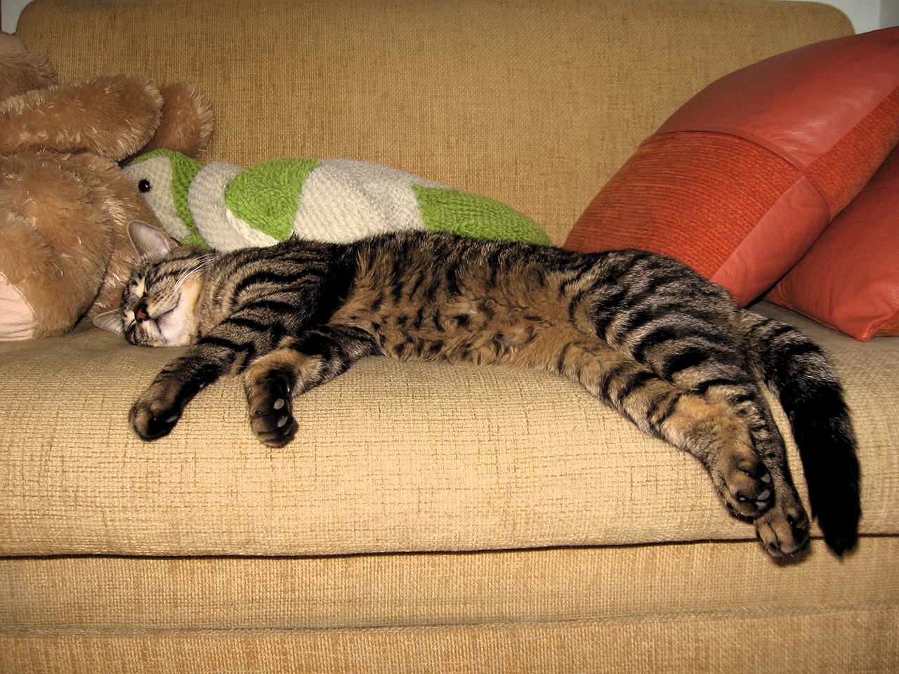

{{back pain alarming symptoms}}

- alarming symptoms:
  - bowel, bladder incontinence
  - saddle anesthesia
  - any FND that's new or rapidly progressing

## Workup

{{someone comes in with lower back pain, workup}}

Someone comes in with ==lower== back pain:

- if alarming symptoms, think **cord compression**:
  - Give IV steroids ASAP
  - Xray or jump to MRI if giving steroids
  - Decompress the compression
    - hematoma: drain
    - abscess: incision drainage + abx
    - cancer: radiation
    - fracture: surgery
- if nonspecific, vague complaints, think **musculoskeletal pain**:
  - NSAIDS, exercise
  - Do not pick bedrest
  - No imaging needed
  - reassess in 4 weeks
    - improvement: continue
    - failed improvement or if positive symptoms: **something else**
      - Xray
      - if negative Xray, MRI
      - some form of surgery

# Cord Compression

{spinal cord compression causes, symptoms, management}

- causes
  - Spinal injury (eg, motor vehicle crash)
  - Malignancy (eg, lung, breast, prostate cancers; myeloma)
  - Infection (eg, epidural abscess with IV drug users or diabetes)
- Symptoms
  - Gradually worsening, severe local back pain
  - **Pain worse** in the recumbent position/at **night**
  - Early signs: Symmetric lower extremity weakness, hypoactive/absent deep-tendon reflexes
  - Late signs: Bilateral Babinski reflex, decreased rectal sphincter tone, paraparesis/paraplegia with increased deep-tendon reflexes, sensory loss

Most patients present with **progressively worsening back pain**.  Pain is usually **worse in the recumbent position** (due to distension of the epidural venous plexus when lying down) in contrast to back pain from degenerative joint disease, which improves with recumbency.  **Bilateral lower-extremity weakness** is present in about 60% of patients.  **Sensory loss** below a spinal level and **gait ataxia** may occur.  **Paraplegia and bowel or bladder dysfunctions** (eg, fecal or urinary retention/incontinence) are late findings.  Examination shows **focal point tenderness** in the spine, **exaggerated deep-tendon reflexes** in the legs, and **upgoing plantar reflexes**.

In the acute phase of spinal cord injury, patients can develop spinal shock and have absence of reflexes and flaccid paraplegia. 

## Management

- Emergency MRI
- Intravenous glucocorticoids
- Radiation-oncology & neurosurgery consultation

{spinal cord compression vs infarction}

- infarction: rapid onset
- compression: slow progressive onset

# MSK Pain

{msk pain path, pt, symptoms, diagnosis, treatment}

- path: muscle spasm
- pt: young, male, heavy lifting
- symptoms: back hurts, no alarming symptoms, "delt like," asymmetric/unilateral
- diagnosis: clinical
- treatment: exercise, NSAIDS.,

# Something Else

## Disc Herniation

{disc herniation path, pt, symptoms, diagnosis, treatment}

- path: nucleus pulposus pinching nerve
- pt: 30-50 yo male, heavy lifting
- symptoms: sciatica, lightning shock pain down leg, positive straight leg test
- diagnosis: Xray probably negative, MRI next
- treatment: depends on severity/lifestyle
  - neurosurgery > conservative at 6 mo (probably atheletes)
  - neurosurgery = conservative at 1 yo (probably older guy just wants to live).,

## Osteophyte

{osteophyte path, pt, symptoms, diagnosis, treatment}

- path: bony spur growing into canal and pinches nerve
- pt: older male, no heavy lifting
- symptoms: asymmetric, unilateral, sciatica, + SLR
- diagnosis: Xray probably negative, MRI showing bone spur
- treatment: surgery. Not going to get better with conservative

## Compression Fracture

{compression fracture path, pt, symptoms, diagnosis, treatment }

- path: osteoporosis
- pt: >50, female, falls
- symptoms: vertebral step-off, pinpoint tenderness
- diagnosis: xray probably positive, MRI better
- treatment: surgery, dexa scan for osteoporosis.,

## Spinal Stenosis

{spinal stenosis path, pt, symptoms, diagnosis, treatment}

- path: narrowing of canal, pinching of nerve
- pt: old, male or female
- symptoms: pseudoclaudication in butt/thighs, positional (claudication when walking around upright)
- diagnosis: xray probably negative, MRI better
- treatment: surgery, laminectomy.,

## Others

{ignore}

- women in menstrual cycle with lower back pain, treatment with NSAIDS

- back pain with abdominal pulsating mass: aortic aneurysm

  